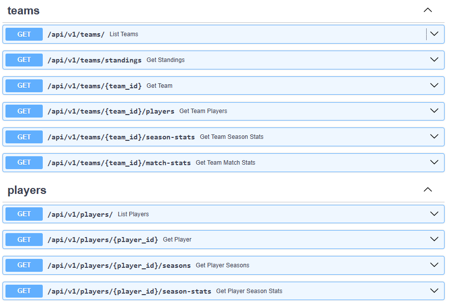
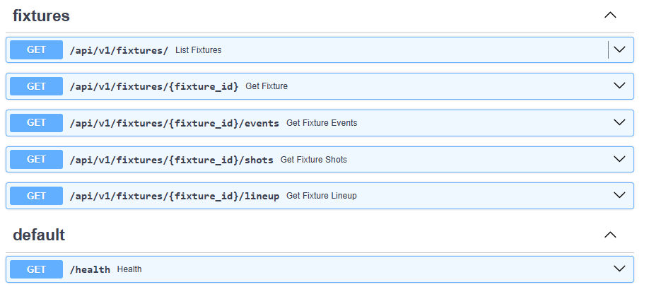
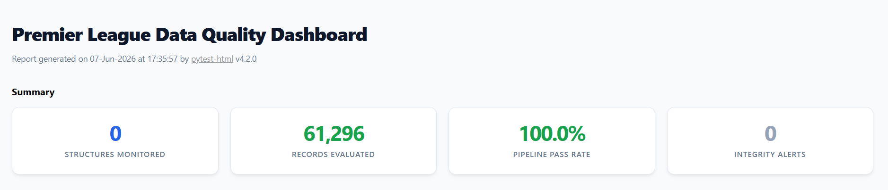
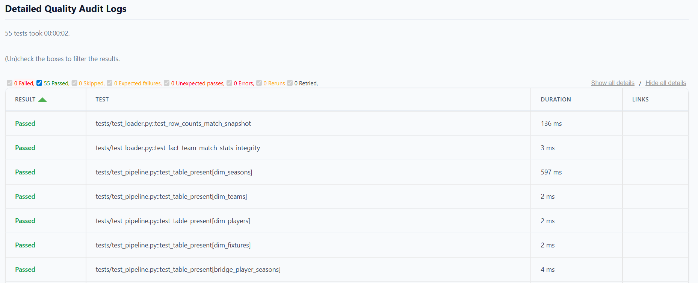
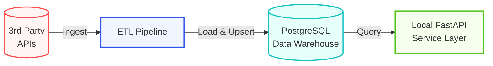

# Premier League Analytics Platform

A Premier League data platform built around a season-based ETL pipeline, versioned CSV snapshots, a PostgreSQL warehouse and a local FastAPI service for querying teams, players, fixtures and season statistics.

The current workflow is:

1. Run the season pipeline
2. Export a CSV snapshot
3. Load the latest snapshot into PostgreSQL
4. Serve the warehouse through the API

## What is in this repository

- `api/` contains the FastAPI application, routers, repository layer and response schemas
- `assets/` contains documentation media and reporting styling configurations
- `data/` is used for generated outputs such as CSV snapshots which are split into seasons and runs
- `pipelines/` contains the ETL pipeline, warehouse contract, snapshot exporter and PostgreSQL loader
- `reports/` is used for generated test reports
- `tests/` contains pipeline and database smoke tests

## Tech Stack

* **Core Language:** Python
* **Data & Storage:** PostgreSQL, SQLAlchemy, pandas, requests
* **API Layer:** FastAPI, Uvicorn
* **Testing & Quality Reporting:** pytest, pytest-html
* **Environment & Tooling:** Conda, python-dotenv

## Requirements

- Python 3.11+ recommended
- PostgreSQL 15+ recommended
- `pip` or another Python package manager

## Setup

Choose one of the methods below to set up your isolated environment and install dependencies.

### Option 1: Using Conda (Recommended)

If you use Anaconda or Miniconda, run the following commands in your terminal:

```bash
# Create the environment with Python 3.11 (or your specific version)
conda create --n premier-league python=3.11 

# Activate the environment
conda activate premier-league
```

### Option 2: Using Python venv 

If you prefer standard virtual environments, use the native commands for your operating system:

### Windows

```bash
python -m venv .venv
.venv\Scripts\activate
```

### macOS / Linux

```bash
python -m venv .venv
source .venv/bin/activate
```

Install the dependencies:

```bash
pip install -r requirements.txt
```

## Environment variables

Create a `.env` file in the project root with your PostgreSQL credentials.

```env
DB_USER=your_user_name
DB_PASSWORD=your_password
DB_HOST=localhost
DB_PORT=5432
DB_NAME=premierleague
```

`.env.example` is the template version of the same file. Keep the actual database password in `.env` and keep `.env.example` safe to commit.

## Generate a snapshot

Run the pipeline for the desired Pulse season ID. The default in this project is `777` (for the 2025/26 season) as this is currently the only one available. In the future, new seasons will be added.

```bash
python -m pipelines.pipeline --season-id 777 --export-snapshots
```

This writes a versioned snapshot under:

```text
data/snapshots/season=2025_26/run=YYYYMMDD_HHMMSS/
```

Each snapshot contains one CSV per warehouse table plus a `manifest.json` file with row counts and metadata.

## Load the latest snapshot into PostgreSQL

After a successful snapshot has been created, load the newest snapshot into PostgreSQL:

```bash
python -m pipelines.load_to_db
```

The loader discovers the latest snapshot automatically from `data/snapshots/`, creates the `warehouse` and `staging` schemas if needed, loads CSVs into staging tables and upserts into the final warehouse tables.

## Run the API

Start the local FastAPI application with Uvicorn:

```bash
uvicorn api.main:app --reload
```

Open the interactive documentation at:

```text
http://127.0.0.1:8000/docs
```

### PLstats API Preview



## Run the tests

In order to validate the warehouse contract, run tests on a specific season while using the latest CSV snapshots:

```bash
python -m pytest -v --season-id 777 --test-from-snapshot latest
```

To generate the HTML data-quality report (with the styling configurable inside `assets/reporting/style.css`):

```bash
python -m pytest -v --season-id 777 --test-from-snapshot latest --html=reports/data_quality/report.html --css=assets/reporting/style.css
```



## Design notes



## Roadmap

Future work plans, in order of priority:

1. Deploy the API with authentication, validation and rate limiting
2. Add CI/CD so tests and packaging run automatically on every change
3. Add Docker and docker-compose for reproducible local and deployment environments
4. Add monitoring, structured logging and health checks
5. Add incremental loading for the next live season
6. Add automated scheduling/orchestration once the season starts updating again
7. Expand observability with run metadata, failure logging and alerts

## License

This project is open-source and available under the terms of the [MIT License](LICENSE).

## Disclaimer

This project is intended strictly for educational and personal entertainment purposes. It is not affiliated with, endorsed by, or legally associated with the English Premier League, FPL or PulseLive. All data fetched belongs entirely to its respective rights holders.
