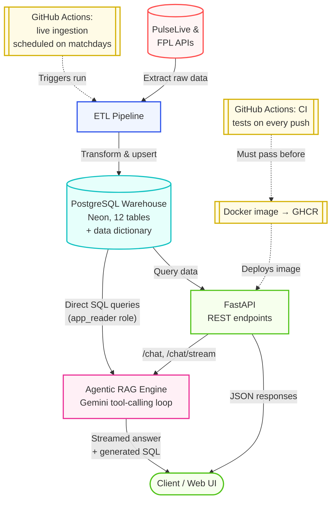

# PitchQuery — Agentic RAG over a Premier League Data Warehouse

PitchQuery lets you ask a Premier League data warehouse questions in plain English and get back a grounded, accurate answer. A tool-calling AI agent (built on Gemini) plans its own path through the schema, writes and executes the SQL it needs and explains the result through a `/chat` endpoint that streams its reasoning step by step.

That agent is the core of the project, but it is only trustworthy because of what sits underneath it: a season-based ETL pipeline that turns two live APIs into a clean, fully-documented PostgreSQL warehouse (12 tables, 360+ columns) covering the complete 2025/26 season and the live, ongoing 2026/27 season — refreshed automatically every matchday by a scheduled GitHub Actions workflow, including a full test environment and packaged as a versioned Docker image via CI/CD. A FastAPI service layer exposes both the structured REST endpoints and the conversational agent on top of that warehouse.

## What this project demonstrates

| Component | What's here |
|---|---|
| **AI Engineering** | An agentic Text-to-SQL RAG system: a Gemini-backed tool-calling loop that inspects schema on demand, grounds every answer in real SQL against the warehouse, refuses out-of-scope questions and streams its reasoning as Server-Sent Events |
| **Data Engineering** | A season-based ETL pipeline into a normalized PostgreSQL warehouse with real foreign keys, an immutable historical baseline, mid-season transfer handling and a full column-level data dictionary |
| **DevOps** | CI on every push (tests + Docker image published to GHCR), a separate scheduled workflow that ingests live gameweek data automatically on matchdays and a fixture-aware guard clause so nothing runs on off days |

## System Architecture



The RAG engine talks to the warehouse over its own direct connection, entirely independent of the FastAPI connection pool and the API layer is a thin wrapper around it, not a dependency it needs to function.

## Tech Stack

* **Core Language:** Python
* **AI Engineering:** Google Gemini (tool-calling / function-calling API), an agentic Text-to-SQL loop with schema-introspection tools and SQL-safety guards
* **Data & Storage:** PostgreSQL (Neon, cloud-hosted), SQLAlchemy, pandas, requests
* **API Layer:** FastAPI, Uvicorn, Server-Sent Events for streamed agent responses
* **Testing:** pytest — a self-contained suite (SQLite/mocked connections, no live calls) plus a separate live-integration suite for the RAG engine that hits the real Gemini API and the real database
* **DevOps:** GitHub Actions (CI on every push, scheduled live ingestion), Docker, GitHub Container Registry
* **Environment & Tooling:** Conda or venv, python-dotenv, Docker Compose (for a local Postgres instance)

## Project Structure

- `rag/` — the agentic RAG engine: the Gemini tool-calling loop (`engine.py`), on-demand schema/data-dictionary context for the model (`schema_context.py`), the read-only SQL safety guard (`sql_guard.py`) and a standalone CLI (`__main__.py`)
- `api/` — the FastAPI application: routers (including `chat.py`, a thin wrapper around `rag/`), a repository layer over raw SQL and Pydantic response schemas
- `data/` — `historical/<season>/` holds the immutable per-season CSV baseline; `snapshots/season=<slug>/run=<timestamp>/` holds versioned exports from live/full-season pipeline runs
- `data_dictionary/` — column-level descriptions applied directly to the warehouse's Postgres catalog (`COMMENT ON COLUMN`), so the schema is self-documenting to both humans and the RAG agent
- `pipelines/`
  - `extract/` — PulseLive and FPL API clients
  - `transform/` — one builder module per warehouse table family (teams, seasons, players, fixtures/events, stats)
  - `load/` — database engine creation, table DDL and the upsert logic that loads a table into the warehouse
  - `schema.py` — the warehouse contract: primary keys, required columns, foreign keys and audit-column handling for every table
  - `utils.py` — shared parsing and inference helpers used across the transform layer
  - `pipeline.py` — orchestrates a full season build end to end
  - `run_live.py` — refreshes the warehouse for the current live season
  - `seed.py` — loads the immutable historical baseline into the warehouse
  - `archive.py` — rolls a completed live season into next year's historical baseline
  - `snapshot.py` — writes a versioned CSV export of a pipeline run, with a manifest
- `tests/` — pipeline, warehouse, API and RAG tests

## Warehouse Schema

The warehouse contains 12 tables structured using Kimball dimensional modeling (split into dimensions and facts):

**Dimensions:** `dim_seasons`, `dim_teams`, `dim_players`, `dim_fixtures`

**Bridge:** `bridge_player_seasons` — tracks which team a player was at across the season, handling mid-season transfers

**Facts:** `fact_match_events` (goals, cards, substitutions), `fact_shot_events`, `fact_match_lineup`, `fact_team_match_stats`, `fact_player_season_stats`, `fact_team_season_stats`, `fact_premier_league_table`

Every table also carries `ingested_at`/`updated_at` audit timestamps and every column has a description in the Postgres catalog via the data dictionary.

The warehouse holds two seasons end to end: the complete, immutable 2025/26 season as a historical baseline and the current 2026/27 season, kept in sync gameweek by gameweek as fixtures are played.

## Requirements

- Python 3.11+ recommended
- A PostgreSQL 15+ instance. This project is developed and deployed against [Neon](https://neon.tech) (serverless Postgres instance), but any Postgres 15+ works 
- A Gemini API key for the RAG chat endpoints — Get one free at [aistudio.google.com/apikey](https://aistudio.google.com/apikey)
- `pip` or another Python package manager

## Setup

Choose one of the methods below to set up your isolated environment and install dependencies.

### Option 1: Using Conda (Recommended)

```bash
conda create --name premier-league python=3.11
conda activate premier-league
```

### Option 2: Using Python venv

**Windows**

```bash
python -m venv .venv
.venv\Scripts\activate
```

**macOS / Linux**

```bash
python -m venv .venv
source .venv/bin/activate
```

Install the dependencies:

```bash
pip install -r requirements.txt
```

## Environment variables

Create a `.env` file in the project root — `.env.example` is the template version of the same file, safe to commit; keep the real values only in `.env`.

**Database** (required — points at your Postgres instance, cloud or local):

```env
DB_USER=your_user_name
DB_PASSWORD=your_password
DB_HOST=your_host_name
DB_PORT=5432
DB_NAME=pitchquery
```

**RAG engine** (required for the `/chat` endpoints and the CLI — the rest of the API works without these):

| Variable | Required | Default | Purpose |
|---|---|---|---|
| `GEMINI_API_KEY` | Yes | — | Authenticates calls to Gemini |
| `GEMINI_MODEL` | No | `gemini-3.5-flash-lite` | The primary model used by the agent loop |
| `GEMINI_FALLBACK_MODEL` | No | `gemini-3.1-flash-lite` | Switched to automatically if `GEMINI_MODEL` hits a rate limit twice in a row |
| `RAG_VERBOSE_TURNS` | No | `false` | `false` shows a friendly, plain-language progress line per turn on the CLI; `true` shows the exact tool call, a truncated SQL preview and the model name every turn — useful for debugging and what the test environment always uses regardless of this setting |
| `RAG_SHOW_SQL` | No | `true` | CLI-only. Set to `false` once you're done testing to hide the "SQL used" line and show only the plain-language answer. The API always returns `sql`/`has_sql` regardless of this setting |

## Seed the historical baseline

Load the immutable 2025/26 season straight from the CSVs under `data/historical/2025_26/`:

```bash
python -m pipelines.seed
```

This creates the `warehouse` and `staging` schemas if needed and upserts every table.

## Refresh the live season

Run the full pipeline for the current live season and upsert the result straight into the warehouse:

```bash
python -m pipelines.run_live --season-id 841
```

By default this also writes a versioned CSV snapshot under `data/snapshots/season=<slug>/run=<timestamp>/` as a landing copy of that run (pass `--no-export-snapshots` to skip it).

To build a season's frames without touching the warehouse (for example just to export a snapshot), use the pipeline directly:

```bash
python -m pipelines.pipeline --season-id 841 --export-snapshots
```

## Apply the data dictionary

After the warehouse tables exist, attach column-level descriptions to the Postgres catalog:

```bash
python -m data_dictionary.apply_data_dictionary
```

Re-run this any time a table is dropped and recreated — comments live in Postgres's own catalog and persist across normal upserts, but not across a `DROP TABLE`.

## Run the API

Start the local FastAPI application with Uvicorn:

```bash
uvicorn api.main:app --reload
```

Open the interactive documentation at:

```text
http://127.0.0.1:8000/docs
```

Available endpoints:

| Method | Path | Description |
|---|---|---|
| GET | `/health` | Warehouse readiness and row counts |
| GET | `/api/v1/teams/` | List teams |
| GET | `/api/v1/teams/standings` | League table for a season |
| GET | `/api/v1/teams/{team_id}` | Team detail |
| GET | `/api/v1/teams/{team_id}/players` | Squad for a team/season |
| GET | `/api/v1/teams/{team_id}/season-stats` | Team season stats |
| GET | `/api/v1/teams/{team_id}/match-stats` | Team stats by fixture |
| GET | `/api/v1/players/` | List players |
| GET | `/api/v1/players/{player_id}` | Player detail |
| GET | `/api/v1/players/{player_id}/seasons` | A player's team history |
| GET | `/api/v1/players/{player_id}/season-stats` | Player season stats |
| GET | `/api/v1/fixtures/` | List fixtures (filterable by season, gameweek, status) |
| GET | `/api/v1/fixtures/{fixture_id}` | Fixture detail |
| GET | `/api/v1/fixtures/{fixture_id}/events` | Goals, cards, substitutions |
| GET | `/api/v1/fixtures/{fixture_id}/shots` | Shot-by-shot data |
| GET | `/api/v1/fixtures/{fixture_id}/lineup` | Starting lineup and minutes played |
| POST | `/api/v1/chat/` | Ask a natural-language question about the warehouse (RAG) |
| POST | `/api/v1/chat/stream` | Same, streamed as progress + a final answer |

## Chat endpoint (RAG)

Both endpoints are thin wrappers around `rag.engine.ask()` / `rag.engine.stream_events()` — the agent loop itself (schema context, tool dispatch, the model call) lives entirely in `rag/engine.py`, which opens its own database connection independent of the FastAPI connection pool used by every other route.

Needs `GEMINI_API_KEY` set (`GEMINI_MODEL`/`GEMINI_FALLBACK_MODEL` are optional — see `.env.example`). `DB_*` is already covered above.

### `POST /api/v1/chat/` — one request, one response

Request:
```json
{"question": "How many goals has Arsenal scored in the 2025/26 season?"}
```

Response:
```json
{"answer": "Arsenal scored 71 goals in the 2025/26 season.", "sql": "SELECT ...", "has_sql": true}
```

`sql` is the full trail of every query the agent ran to reach its answer, or `null` if it declined to run SQL at all (an out-of-scope question, or a request it couldn't complete). `has_sql` is a convenience flag for the same thing. This is a purely for the backend as in the frontend the SQL statement can easily not be shown.

### `POST /api/v1/chat/stream` — progress, then the answer

Same request body, but streamed as [Server-Sent Events](https://developer.mozilla.org/en-US/docs/Web/API/Server-sent_events) so the client can show what the agent is doing instead of blocking on a response that can take some time to answer: a `progress` event per step in plain language (never raw tool names or turn counts), then one `result` event shaped like the original endpoint's response.

```
event: progress
data: {"turn": 1, "message": "Reading match events information..."}

event: progress
data: {"turn": 2, "message": "Running SQL query..."}

event: result
data: {"answer": "...", "sql": "...", "has_sql": true}
```

An `error` event means the stream itself broke (a bad connection, a bug) — a failed or rate-limited Gemini call is handled gracefully instead and still arrives as a normal `result` event with an explanatory answer. 

## Run the tests

```bash
python -m pytest -v
```

The default suite is fully self-contained with no live network calls and no real Postgres required; every fixture is pure Python/pandas or an in-memory SQLite engine. The RAG engine also has a live integration suite (`tests/test_rag.py`) that hits the real Gemini API and the real Neon database, covering correctness probes (per-90 rate conventions, set-piece assist table selection, tie handling) and out-of-scope refusals. It's excluded by default and opt-in via its marker:

```bash
pytest tests/test_rag.py -m live_rag -v -s
```

## Continuous Integration & Live Ingestion

Two GitHub Actions workflows keep the project self-updating:

- **CI** (`.github/workflows/ci.yml`) — runs the full test environment on every push and pull request against `main`. On a successful push to `main`, a second job builds the API image and publishes it to GitHub Container Registry, tagged both `latest` and with the commit SHA.
- **Live ingestion** (`.github/workflows/live_ingestion.yml`) — runs on a schedule throughout each matchday, checks whether any Premier League fixtures are happening that day and only if so: runs the test environment as a gate, refreshes the warehouse for the live season, then smoke-tests the API's `/health` endpoint against the fresh data. Days with no fixtures short-circuit immediately, so the workflow never pushes empty runs.

## Docker

The API is published as a standalone image so you can pull and run it without cloning the repo or installing Python:

```bash
docker pull ghcr.io/<owner>/<repo>:latest

docker run -p 8000:8000 \
  -e DB_USER=your_user_name \
  -e DB_PASSWORD=your_password \
  -e DB_HOST=your_host \
  -e DB_PORT=5432 \
  -e DB_NAME=pitchquery \
  -e GEMINI_API_KEY=your_gemini_api_key \
  ghcr.io/<owner>/<repo>:latest
```

The image contains the API only (`api/` plus its dependencies) and it does not run the pipeline. `DB_*` is required for every route; `GEMINI_API_KEY` is required only if you want the `/chat` endpoints to work (omit it and the rest of the API still runs normally). Point `DB_*` at any reachable Postgres 15+ instance. Once running, the API is available at `http://localhost:8000`, same as the local Uvicorn instructions above.

## Future work

### 1. Web application
* **Interactive frontend:** a web app for browsing teams, players and fixtures and asking natural-language questions across both historical and live gameweek stats.
* **Chatbot integration:** surface the existing `/chat` and `/chat/stream` endpoints as an in-app conversational feature, using the streamed progress events for a responsive UX.
* **Authentication & rate limiting:** add user auth and request limiting so the API and the RAG engine are safe to expose publicly.

### 2. Multimodal & voice exploration
* Investigate Gemini Live for a real-time, voice-driven interface to the warehouse as a future component of the project. Broader multimodal generative features are of interest too, but are not currently available on the free tier this project runs on, so this is exploratory rather than committed.

## License

This project is open-source and available under the terms of the [MIT License](LICENSE).

## Disclaimer

This project is intended strictly for educational and personal entertainment purposes. It is not affiliated with, endorsed by, or legally associated with the English Premier League, FPL or PulseLive. All data fetched belongs entirely to its respective rights holders.
