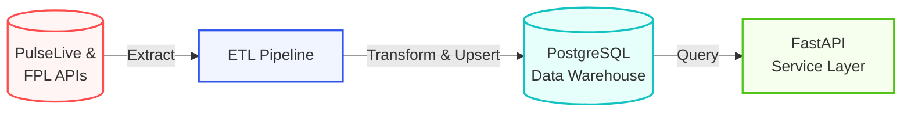

# PL Data Engine

A Premier League data engine built around a season-based ETL pipeline, a PostgreSQL data warehouse with real foreign-key relationships, and a FastAPI service for querying teams, players, fixtures and season statistics.

The warehouse covers two seasons end to end: an immutable historical baseline (2025/26) and the current live season (2026/27), kept in sync gameweek by gameweek.

## System Architecture



## Tech Stack

* **Core Language:** Python
* **Data & Storage:** PostgreSQL, SQLAlchemy, pandas, requests
* **API Layer:** FastAPI, Uvicorn
* **Testing:** pytest (self-contained — SQLite for database tests, a mocked connection for API tests; no live network or real Postgres required)
* **Environment & Tooling:** Conda or venv, python-dotenv, Docker Compose (for a local Postgres instance)

## Project Structure

- `api/` — the FastAPI application: routers, a thin repository layer over raw SQL, and Pydantic response schemas
- `data/` — `historical/<season>/` holds the immutable per-season CSV baseline; `snapshots/season=<slug>/run=<timestamp>/` holds versioned exports from live/full-season pipeline runs
- `data_dictionary/` — column-level descriptions applied directly to the warehouse's Postgres catalog (`COMMENT ON COLUMN`), so the schema is self-documenting to any tool that introspects it
- `pipelines/`
  - `extract/` — PulseLive and FPL API clients
  - `transform/` — one builder module per warehouse table family (teams, seasons, players, fixtures/events, stats)
  - `load/` — database engine creation, table DDL, and the upsert logic that loads a table into the warehouse
  - `schema.py` — the warehouse contract: primary keys, required columns, foreign keys, and audit-column handling for every table
  - `utils.py` — shared parsing and inference helpers used across the transform layer
  - `pipeline.py` — orchestrates a full season build end to end
  - `run_live.py` — refreshes the warehouse for the current live season
  - `seed.py` — loads the immutable historical baseline into the warehouse
  - `archive.py` — rolls a completed live season into next year's historical baseline
  - `snapshot.py` — writes a versioned CSV export of a pipeline run, with a manifest
- `tests/` — pipeline, warehouse and API tests; fully self-contained

## Warehouse Schema

Twelve tables, split into dimensions and facts, all linked by real Postgres foreign keys:

**Dimensions:** `dim_seasons`, `dim_teams`, `dim_players`, `dim_fixtures`

**Bridge:** `bridge_player_seasons` — tracks which team a player was at across the season, handling mid-season transfers

**Facts:** `fact_match_events` (goals, cards, substitutions), `fact_shot_events`, `fact_match_lineup`, `fact_team_match_stats`, `fact_player_season_stats`, `fact_team_season_stats`, `fact_premier_league_table`

Every table also carries `ingested_at`/`updated_at` audit timestamps, and every column has a description in the Postgres catalog via the data dictionary.

## Requirements

- Python 3.11+ recommended
- PostgreSQL 15+ recommended (a `docker-compose.yml` is included for a local instance)
- `pip` or another Python package manager

## Setup

Choose one of the methods below to set up your isolated environment and install dependencies.

### Option 1: Using Conda (Recommended)

```bash
conda create --name premier-league python=3.11
conda activate premier-league
```

### Option 2: Using Python venv

**Windows**

```bash
python -m venv .venv
.venv\Scripts\activate
```

**macOS / Linux**

```bash
python -m venv .venv
source .venv/bin/activate
```

Install the dependencies:

```bash
pip install -r requirements.txt
```

## Environment variables

Create a `.env` file in the project root with your PostgreSQL credentials:

```env
DB_USER=your_user_name
DB_PASSWORD=your_password
DB_HOST=localhost
DB_PORT=5432
DB_NAME=premierleague
```

`.env.example` is the template version of the same file. Keep the actual password in `.env` and keep `.env.example` safe to commit.

If you don't already have a Postgres instance, bring one up locally with:

```bash
docker compose up -d
```

## Seed the historical baseline

Load the immutable 2025/26 season straight from the CSVs under `data/historical/2025_26/`:

```bash
python -m pipelines.seed
```

This creates the `warehouse` and `staging` schemas if needed and upserts every table.

## Refresh the live season

Run the full pipeline for the current live season and upsert the result straight into the warehouse:

```bash
python -m pipelines.run_live --season-id 777
```

By default this also writes a versioned CSV snapshot under `data/snapshots/season=<slug>/run=<timestamp>/` as a landing copy of that run (pass `--no-export-snapshots` to skip it).

To build a season's frames without touching the warehouse — for example just to export a snapshot — use the pipeline directly:

```bash
python -m pipelines.pipeline --season-id 777 --export-snapshots
```

## Apply the data dictionary

After the warehouse tables exist, attach column-level descriptions to the Postgres catalog:

```bash
python -m data_dictionary.apply_data_dictionary
```

Re-run this any time a table is dropped and recreated — comments live in Postgres's own catalog and persist across normal upserts, but not across a `DROP TABLE`.

## Run the API

Start the local FastAPI application with Uvicorn:

```bash
uvicorn api.main:app --reload
```

Open the interactive documentation at:

```text
http://127.0.0.1:8000/docs
```

Available endpoints:

| Method | Path | Description |
|---|---|---|
| GET | `/health` | Warehouse readiness and row counts |
| GET | `/api/v1/teams/` | List teams |
| GET | `/api/v1/teams/standings` | League table for a season |
| GET | `/api/v1/teams/{team_id}` | Team detail |
| GET | `/api/v1/teams/{team_id}/players` | Squad for a team/season |
| GET | `/api/v1/teams/{team_id}/season-stats` | Team season stats |
| GET | `/api/v1/teams/{team_id}/match-stats` | Team stats by fixture |
| GET | `/api/v1/players/` | List players |
| GET | `/api/v1/players/{player_id}` | Player detail |
| GET | `/api/v1/players/{player_id}/seasons` | A player's team history |
| GET | `/api/v1/players/{player_id}/season-stats` | Player season stats |
| GET | `/api/v1/fixtures/` | List fixtures (filterable by season, gameweek, status) |
| GET | `/api/v1/fixtures/{fixture_id}` | Fixture detail |
| GET | `/api/v1/fixtures/{fixture_id}/events` | Goals, cards, substitutions |
| GET | `/api/v1/fixtures/{fixture_id}/shots` | Shot-by-shot data |
| GET | `/api/v1/fixtures/{fixture_id}/lineup` | Starting lineup and minutes played |

## Run the tests

```bash
python -m pytest -v
```

No flags, no live network calls, and no real Postgres required — every fixture is either pure Python/pandas or backed by an in-memory SQLite engine.

## Future work

The next phase of this project focuses on transitioning from a local data engine to an automated, cloud-hosted platform equipped with an intelligent conversational interface.

### 1. Enterprise Knowledge Access (Agentic RAG & Web App)
* **Agentic RAG Architecture:** Develop a RAG system capable of querying across the relational warehouse to deliver grounded, context-aware answers about player and team performance.
* **Interactive Frontend:** Build a web application interface allowing users to ask natural-language questions across both historical and live gameweek stats.

### 2. Automated Orchestration & Live Ingestion
* **Scheduled Data Pipelines:** Implement automated orchestration (e.g., Prefect or Apache Airflow) to trigger incremental ETL runs aligned with Premier League matchday schedules.
* **Incremental Delta Loading:** Further optimize live-season gameweek updates without full re-ingestion of historical data.

### 3. Cloud Infrastructure & Production DevOps
* **Containerization & Deployment:** Package services with Docker and deploy the database and FastAPI service to cloud infrastructure.
* **API Hardening:** Implement authentication, request validation and rate limiting for secure public access.
* **CI/CD & Observability:** Automate testing and deployment via GitHub Actions and integrate structured logging, health checks and run metadata tracking.

## License

This project is open-source and available under the terms of the [MIT License](LICENSE).

## Disclaimer

This project is intended strictly for educational and personal entertainment purposes. It is not affiliated with, endorsed by, or legally associated with the English Premier League, FPL or PulseLive. All data fetched belongs entirely to its respective rights holders.
